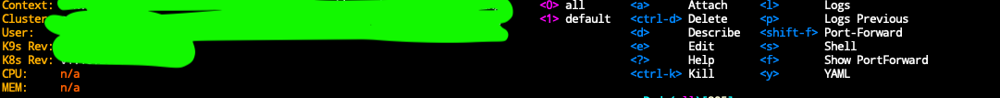
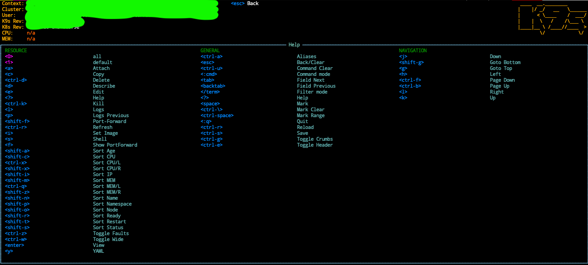

+++
title = 'K9s and How I Loved Exploring Kubernetes Again'
date = 2021-11-08T21:11:09-05:00
draft = false
tags = ["k9s", "k8s", "kubernetes", "kubectl", "eks", "aws", "infrastructure"]
+++

I use kubenetes regularly, and most of the time I cannot remember what command
to run let say to open shell into a container or to list the current containers and so.
`kubectl` command is very powerful but also very very verbose :)

[k9s](https://k9scli.io) is the perfect tool for me as it make these command super easy to run the following (and much more) with
one keystoke:

1. Open a shell in a container.
2. Show the logs of a container.
3. where can you find all the shortcut.
4. ...

## Install k9s
```shell
# via homebrew
brew install derailed/k9s/k9s
```
Linux and Windows are supported, check k9s [installation page](https://k9scli.io/topics/install/)
for what needs to be done

## Configure your kubernetes context (kubeconfig)
In order to connect to you kubernetes cluster, you will need a kubeconfig file that most of the time will
live in `~/.kube/config`.

As an AWS user, I'm going to use aws cli to create this file for me.
```shell
aws eks --region <region-code> update-kubeconfig --name <cluster_name>
```

For more info, check [AWS guide to create kubeconfig](https://docs.aws.amazon.com/eks/latest/userguide/create-kubeconfig.html
)

## Run k9s
 ```shell
# run k9s from the command line
k9s
```
You should see k9s ui.


## How to open a shell inside a container
Once you select your running container, hit `s` button and Voila!


## List of shortcuts

- Shell: `s`
- Logs: `l`
- Describe: `d`
- Attach: `a`
- Delete: `ctrl-d`
- Edit: `e`
- Help: `?`
- Kill: `ctrl-k`
- Logs previous: `p`
- Port-Forward: `shift-f`
- Show PortForward: `f`
- YAML: `y`


These commands can change in the future, there are available on the top left of the ui in case you need them :)


To get the complete list of shortcuts, hit `?` to go into the help section

yes